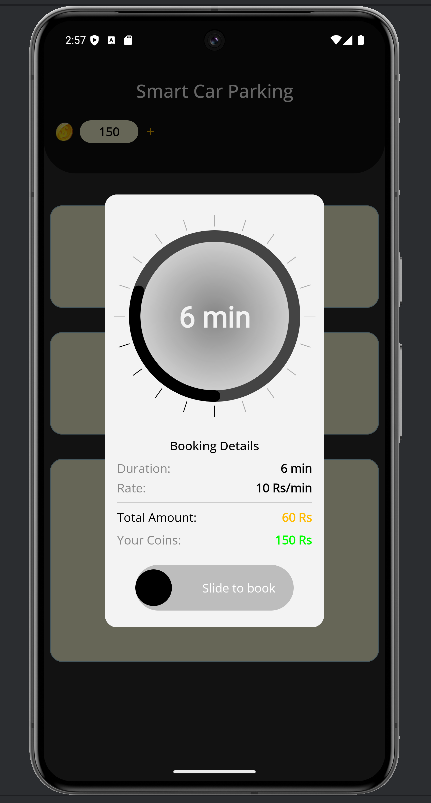
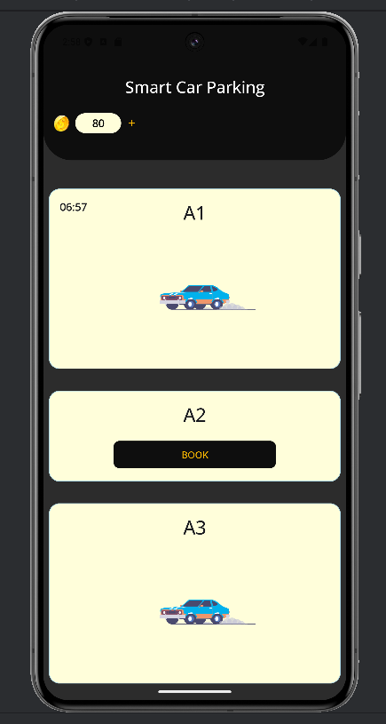
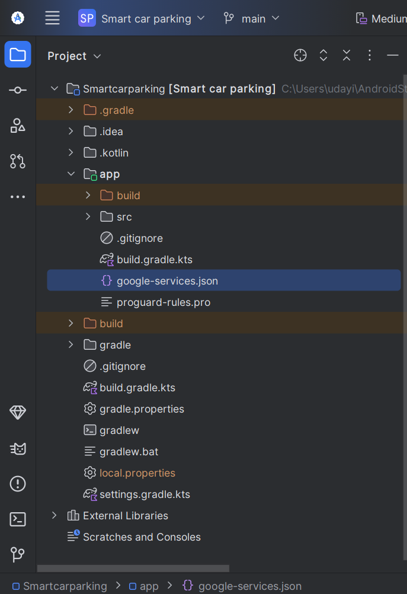

# Smart Car Parking System using ESP32, Firebase & Jetpack Compose

A real-time IoT-based smart car parking system that integrates **ESP32**, **IR sensors**, **Firebase Realtime Database**, and  **Jetpack Compose** Android mobile app. This system enables real-time vehicle detection, slot monitoring, booking, and dynamic UI updates.

---

## 🧠 Project Overview

It is a real-time parking slot monitoring system.The IR sensors detect vehicle presence, while an ESP32 microcontroller communicates with Firebase. The Android app fetches this data and provides users with:

- Live slot availability
- Slot booking via coins
- Countdown-based reservation
- Animated and responsive UI

---

## 🛠️ Tech Stack

### **Hardware**
- ESP32 microcontroller
- IR sensors (for detecting parked vehicles)

### **Cloud**
- Firebase Realtime Database

### **Mobile App**
- Jetpack Compose (Kotlin)
- Firebase SDK
- Lottie animations
- Shimmer loading effects

---

## 🔑 Features

- 🔍 **Real-time Slot Monitoring:**  
  IR sensors detect whether a slot is occupied, updating the status to Firebase instantly.

- 📱 **Android App with Jetpack Compose:**  
  - Listens to Firebase for live updates  
  - Shows available/booked/occupied slots using animated cards  
 

- 💰 **Coin-Based Slot Booking:**  
  - Each minute of parking costs 10 coins  
  - Users can add coins and track balance

- ⏳ **Timed Reservations:**  
  - Bookings run on a countdown timer  
  - Slots are auto-released after the timer ends

---

## Getting Started

To get started with  follow these steps:

1. Clone the repository:

    ```bash
    git clone https://github.com/gold-roger33/Smart-Carparking-with-ESP32.git   
    ```
2. Project Structure

    ```plaintext
    Smart-Carparking-with-ESP32/
            ├── Smartcarparking/     #Android app code          
            │
            ├── ESP32/              # Microcontroller Code
            │                            
            └── README.md
    ```     
---

## 📸 Screenshots
<div style="display: flex; gap: 10px;">

  

  

</div>

---

## 🧪 Firebase Database Structure

```json
{
  "parking_spots": {
    "A1": {
      "booked": false,
      "occupied": false
    },
    "A2": {
      "booked": false,
      "occupied": false
    },
    "A3": {
      "booked": true,
      "occupied": true
    },
  }
}
```

You need to create firebase realtime database folder like this and enable read and write perrmissions. and download the jetpack compose configuration file (google-services.json) to  android directory like this.





---

## 🔧 ESP32 Configuration

Before uploading the `esp_carparking.ino` file to your ESP32, make sure to configure your Wi-Fi and Firebase credentials:

Open `ESP32/esp_carparking.ino` and update the following lines:

```cpp
#define WIFI_SSID "your_wifi_ssid"
#define WIFI_PASSWORD "your_wifi_password"

#define FIREBASE_HOST "your-project-id.firebaseio.com"
#define FIREBASE_AUTH "your_firebase_database_secret"
